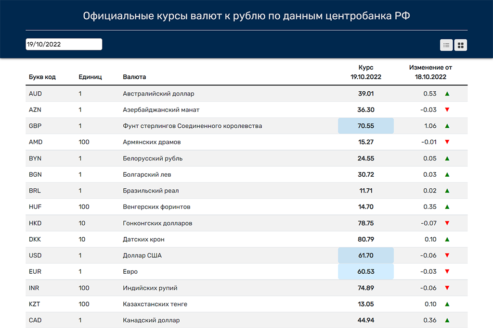

<h1 align="center">
Currency rates (backend)

</h1>

https://repti85.github.io/Currency-rates

<h3>This web app using frontend deployed on "Github pages"</h3>
  https://github.com/repti85/Currency-rates.git 
  

## Implementation:
The application sends a request to the api of the Central Bank of the Russian Federation for the required date and the previous one and receives data in xml format, which it processes and converts into an array with objects, including:
- etter code,
- amount,
- Name,
- price on the requested date,
- previous date price

## Features:
**Technologies used: HTML, CSS, Bootstrap, JavaScript, React, Redux/Redux-toolkit**

