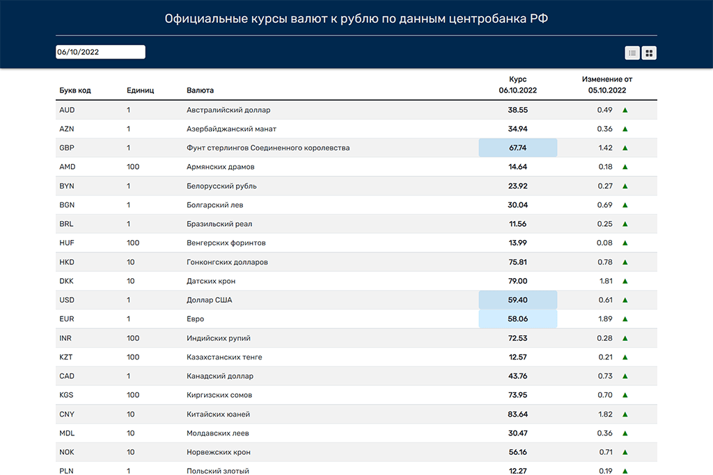

<h1 align="center">
<a href="https://repti85.github.io/Currency-rates">
Currency rates
</a>
</h1>

https://repti85.github.io/Currency-rates

<h3>This web app using frontend deployed on "Github pages"</h3>
https://github.com/repti85/Currency-rates.git
  

## Contain:
- **Data on exchange rates for any date**
- **Rates change display**
- **Switcher tabular view/mosaic view**

## Features:
- **Adaptive layout**
- **Technologies used: HTML, CSS, Bootstrap, JavaScript, React, Redux/Redux-toolkit**

## Appearance:

