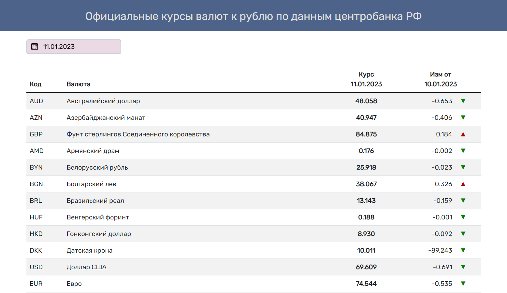
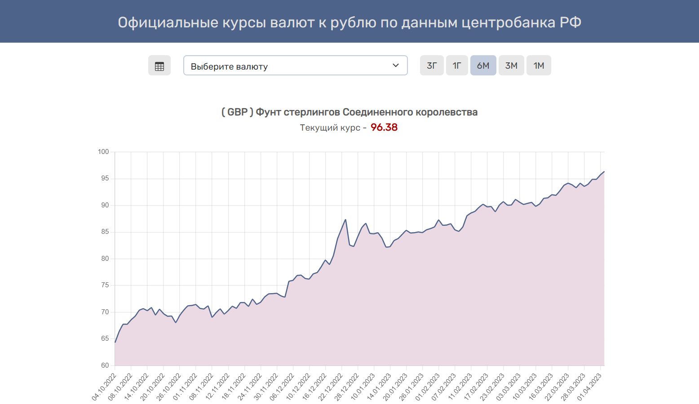

<h1 align="center">
Currency rates (backend)
</h1>

<h3>This web application is deployed on "Vercell" and uses the frontend deployed on "Github Pages"</h3>

  **Github (frontend):**  https://github.com/repti58/Currency-rates.git 
  

https://repti58.github.io/Currency-rates

## Implementation:
1. The application sends a request to the API of the Central Bank of the Russian Federation for the required date and the previous one and receives data in xml format, which it processes and converts into an array with objects, including:
- letter code,
- Name,
- price on the requested date (amount calculated),
- previous date price (amount calculated)

2. Generates a request for the selected currency and selected period , receives data via API of the Central Bank of Russian Federation in xml format, converts it to json, forms an array with data and sends it to the frontend

## Features:
**Language: JavaScript**

**Modules used: ExpressJS, Needle, Cors, XML-JS**

